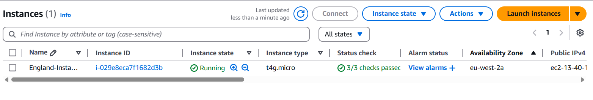
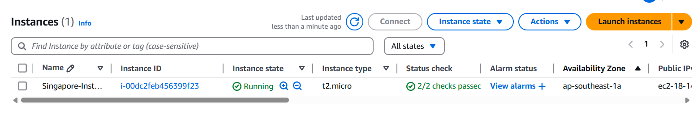

## Terraform 

### What is terraform 
Terraform is an Infrastructure as Code (IaC) tool. It allows you to define and manage infrastructure (like servers, databases) using declarative, human-readable configuration files. These files can be reused, shared, and version-controlled. This allows for automation and consistency, as opposed to manually managing infrastructure through cloud provider consoles like the AWS Console.

Terraform works with multiple cloud providers such as AWS, Azure, GCP, Kubernetes

There are 3 stages to a Terraform workflow 
### Terraform workflow 
1. Write: Define cloud infrastructure. In our case it is creating 2 instances of a VM using AWS EC2 
2. Plan: Terraform creates an execution plan. This execution plan describes infrastructure it will create, update or destroy based on existing infrastructure. 
3. Apply: Terraform performs the proposed operations (from the plan)

### Homework assignment - 
- Used Terraform to provision 2 EC2 instances on different availability zones. EC2 is a virtual machine on aws 
- Created an EC2 instance in the London region (closest region to me) and Singapore region (closest region to Malaysia) 
- Created a provider in the eu-west-2 region and created a resource (the VM) with a public AMI associated with that provider
- Created a provider in the ap-southeast-1 region and created a resource (the VM) with a public AMI associated with that provider

Used the commands 

terraform init
terraform plan 
terraform apply 
terraform destroy (to destroy the VMs later on) 

Results: 

Resources:
https://developer.hashicorp.com/terraform/docs
https://registry.terraform.io/providers/hashicorp/aws/latest/docs

